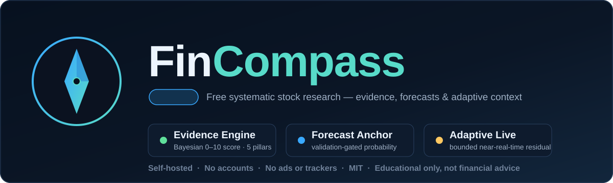

<p align="center">
  
</p>

<p align="center">
  
  
  
  
  
  
</p>

# FinCompass

**Free, self-hostable systematic stock research** — a FastAPI + vanilla-JavaScript workbench with three
deliberately separated analytical layers. No accounts, no subscriptions, no advertising, no analytics, no paid
frontend libraries, no proprietary cloud backend.

1. **Evidence engine** — a transparent 0–10 Bayesian research score across Quality, Financial Durability, Safety, Valuation and Cycle, with per-pillar uncertainty.
2. **Forecast anchor** — a calibrated forward-event probability model that activates *only* after a real historical dataset passes temporal, calibration and locked-test validation gates.
3. **Adaptive live layer** — timestamped market/filing/macro context plus a bounded sequential Bayesian residual that may adjust the anchor only after a separate prequential activation gate passes.

> **Educational research support, not financial advice.** The evidence score is not a return forecast. A forecast
> probability, when available, applies only to the exact event definition, horizon, benchmark, hurdle, dataset and
> model manifest that produced it. No probability is a guarantee.

---

## Get started in one click

FinCompass is designed so an end user **never needs the command line**.

| Platform | How |
|---|---|
| **Windows (installer)** | Run `FinCompass-1.2.0-Setup.exe` → launch from the Start menu. Windowed app, no console. |
| **Windows (portable)** | Double-click **`run.bat`** — it creates the environment and opens the app. |
| **macOS / Linux** | Run `./run.sh`. |

The app opens at `http://127.0.0.1:8000/`. Local data (watchlist, settings, any models you build) lives in a
writable per-user directory and survives upgrades.

📘 **New here? Read the [User Manual (PDF)](docs/FinCompass-User-Manual.pdf)** for a guided walkthrough of every workspace. It's also linked in the app footer.

Everything operational is an **in-app button**, including:

- **Refresh universe** — repopulate the screener from free public data.
- **Build forecast model** — train a forecast model from free public data as a background job, with live
  progress. No scripts. (A real model is often gate-rejected — that is the tool being honest, not a failure.)

<details>
<summary><strong>Run from source (developers)</strong></summary>

```bash
python -m venv .venv
source .venv/bin/activate        # Windows: .venv\Scripts\activate
pip install -r requirements.txt
cp .env.example .env
uvicorn api:app --host 127.0.0.1 --port 8000
```

Build the desktop executable and installer:

```bash
build_exe.bat            # -> dist\FinCompass.exe  (windowed, version-stamped)
build_installer.bat      # -> dist\FinCompass-1.2.0-Setup.exe  (needs Inno Setup)
```
</details>

---

## What's new in 1.2.0

- **In-app forecast model build (no CLI).** Train a model from free public data entirely in the app — background
  job, SQLite-tracked progress, saved to a writable models directory so packaged builds can train and activate
  models. Endpoints: `POST /api/v4/forecast/build`, `GET /api/v4/forecast/build/status`.
- **Windowed desktop app + Windows installer.** No console window; a small control window with Open/Quit and
  graceful shutdown. Version-stamped `.exe` with copyright, plus an Inno Setup installer.
- **Investor Posture indicators** (added in 1.1.0). Three mechanically-derived, model-free research signals —
  New-Position Priority, Accumulation Signal, Re-Underwrite Trigger — shown below the pillar boxes. Research
  signals, not buy/sell recommendations; no combined verdict, no personalization.

See [`CHANGELOG.md`](CHANGELOG.md) for the full history.

---

## The three layers

### 1. Evidence engine

A transparent 0–10 Bayesian research score across five pillars — **Quality, Financial Durability, Safety,
Valuation, Cycle** — each with an evidence-coverage measure and a 90% credible interval. Missing evidence shrinks
the posterior toward neutral and widens uncertainty rather than silently guessing.

### 2. Forecast anchor

A calibrated forward-event probability model, kept strictly separate from the evidence score.

- Bayesian logistic regression (Laplace posterior) + histogram gradient boosting + regularized random forest.
- Purged chronological train / validation / locked-test partitions with **target-horizon purge + embargo at every internal boundary**.
- Locked-test Brier/skill, log-loss/skill, ROC AUC, average precision, ECE and calibration slope/intercept, temporal-breadth gates and clustered-bootstrap bound gates.
- Abstention near a configurable neutral band; model registry with hash verification and validation tiers.

**Validation tiers**

| Tier | Meaning |
|---|---|
| `fixture_only` | Synthetic software/statistics validation only — **never usable for live forecasts**. |
| `rejected` | Failed one or more configured validation gates. |
| `validated_research` | Passed statistical gates on a real dataset, but dataset limitations remain (e.g. current-universe survivorship bias). |
| `validated_market` | Passed the gates **and** the manifest documents point-in-time features, survivorship control, delistings and corporate-action-adjusted prices, with evidence for each control. |

The app refuses to promote a synthetic fixture or a failed model into the live Forecast workspace.

**Point-in-time data.** The SEC CompanyFacts path makes a fundamental feature available on its **filing date**, not
the fiscal period end — preventing a common form of backtest look-ahead leakage. The bundled public-data builder
stays conservative: today's curated universe plus free price-provider fallbacks can earn `validated_research`, but
not `validated_market`.

### 3. Adaptive live layer

Source-cadence market, SEC filing and FRED macro context with explicit timestamps, freshness and staleness, plus a
bounded sequential Bayesian log-odds residual over the validated anchor.

- Strict **matured-label-only** updates; unresolved observations never train themselves.
- Prequential predict-before-update monitoring and anchor-relative EWMA drift detection.
- Activation requires matured-label count, observation-date/span breadth, date-balanced non-inferiority, date-balanced calibration error, and no active drift alert — otherwise it falls back to the frozen anchor.
- Append-only local event store, privacy-safe aggregate source-health telemetry, versioned adaptive state.

Built-in free market polling is **near-real-time / best-effort**, not exchange-grade streaming. See [`REALTIME.md`](REALTIME.md).

---

## Three probabilities you must not conflate

| Concept | Example | Means |
|---|---|---|
| **Evidence-score posterior** | `P(score ≥ 8)` | Posterior mass above an evidence-score threshold. Not about returns. |
| **Anchor forward-event probability** | `63%` | Validated model's probability for the *exact event in its manifest* (e.g. outperform SPY by >0% over 252 trading days). |
| **Adaptive applied probability** | anchor ± residual | Anchor adjusted by the bounded residual **only** when its separate gate is active; otherwise the frozen anchor. |

None of these means a target price, an expected return, a chance of profit on every path, or a recommendation.

---

## API

Stable surface under `/api/v1/*`; forecasting/adaptive also under versioned namespaces. Swagger/OpenAPI at `/docs`.

| Method | Endpoint | Purpose |
|---|---|---|
| GET | `/api/v1/health` | App, engines, provider health, registry status |
| GET | `/api/v1/analyze/{ticker}` | Five-pillar evidence analysis (incl. Investor Posture) |
| GET | `/api/v1/screener` | Cached evidence universe |
| GET | `/api/v1/history/{ticker}` | Price-history context |
| GET | `/api/v4/forecast/status` | Validated anchor registry / activation status |
| GET | `/api/v4/forecast/{ticker}` | Forward-event probability from a validated anchor |
| POST | `/api/v4/forecast/build` | Start an in-app model build (background job) |
| GET | `/api/v4/forecast/build/status` | In-app build progress |
| GET | `/api/v4/realtime/{ticker}` | Freshness-aware anchor + adaptive live snapshot |
| POST | `/api/v4/adaptive/process-matured` | Process eligible delayed outcomes into adaptive state |
| GET | `/api/v1/methodology` | Evidence + anchor + adaptive methodology |

---

## Tests and release verification

```bash
pip install -r requirements-dev.txt
python tools/verify_release.py
```

The verifier runs compilation, the full automated suite, JavaScript syntax validation, CSP/frontend dependency
scanning, anchor/adaptive dataset-hash verification, fixture-tier lockout, model/adaptive-artifact hash and
contract checks, forecast/realtime configuration drift checks, documentation consistency checks, and Docker
packaging/ownership checks. The frozen v1.2.0 release gate passes **119 automated tests** before packaging.

---

## Documentation

[`ARCHITECTURE.md`](ARCHITECTURE.md) ·
[`MODEL_CARD.md`](MODEL_CARD.md) ·
[`FORECASTING.md`](FORECASTING.md) ·
[`REALTIME.md`](REALTIME.md) ·
[`VALIDATION_PROTOCOL.md`](VALIDATION_PROTOCOL.md) ·
[`SETTINGS.md`](SETTINGS.md) ·
[`DEVELOPER_GUIDE.md`](DEVELOPER_GUIDE.md) ·
[`docs/DOCKER.md`](docs/DOCKER.md) ·
[`docs/HELP.md`](docs/HELP.md) ·
[`SECURITY.md`](SECURITY.md) ·
[`PRIVACY.md`](PRIVACY.md)

---

## License

**MIT** — see [`LICENSE`](LICENSE). Copyright © 2026 Rajeev Yadav. You may use, copy, modify and redistribute
FinCompass, including commercially, provided the MIT copyright and permission notice are retained. The software is
provided “as is”, without warranty of any kind.

---

<p align="center"><sub><strong>Educational only. Not financial advice or an assurance of future performance.</strong></sub></p>
