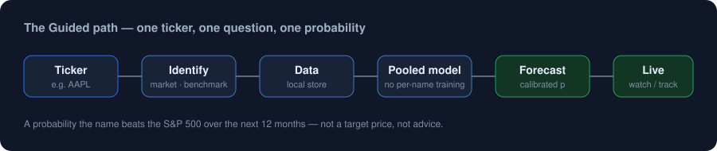

<p align="center">
  
</p>

<p align="center">
  
  
  
  
  
  
</p>

<p align="center"><strong>A local research workbench for one honest question:</strong><br>
<em>Over the next year, how likely is this company to do better than the S&amp;P 500?</em></p>

<p align="center">
  
</p>

FinCompass runs on your machine — no account, no subscription, no ad network, no cloud model API. A **Forecast** is a calibrated probability for that exact event. It is **not** a target price, expected return, or advice to buy or sell.

---

## Contents

- [What it is](#what-it-is)
- [Get started](#get-started)
- [Two screens, one number](#two-screens-one-number)
- [The model ladder](#the-model-ladder)
- [What a percent means](#what-a-percent-means)
- [Analytics desks](#analytics-desks)
- [For developers](#for-developers)
- [Documentation](#documentation)
- [Limits](#limits)
- [License, privacy, and disclaimer](#license-privacy-and-disclaimer)

---

## What it is

Four layers, kept apart on purpose.

| Layer | Job |
|---|---|
| **Evidence** | 0–10 snapshot of quality, durability, safety, valuation, cycle. About *now*, not next year. |
| **Forecast** | Calibrated probability that the name beats a stated benchmark over a stated horizon. |
| **Live** | Watches the frozen Forecast. A Limited-evidence model is tracking-only. A stronger model may apply a small residual only after delayed outcomes pass a gate. |
| **Analytics** | Performance, risk, statements, ratios, DCF, bonds, options, portfolio, factors. Useful desks — never Forecast features unless a versioned contract admits them. |

---

## Get started

The end user should not need a terminal.

| Platform | How | From source |
|---|---|:---:|
| **Windows installer** | Run the Setup executable, launch from the Start menu (windowed, no console). | — |
| **Windows portable** | Double-click [`run.bat`](run.bat). | ✅ |
| **macOS / Linux** | `./run.sh` | ✅ |

The app opens at **http://127.0.0.1:8000/**. Your watchlist, settings, local prices, and any models you build live in a per-user directory and survive upgrades.

**From source**

```bash
python -m venv .venv
source .venv/bin/activate          # Windows: .venv\Scripts\activate
pip install -r requirements.txt
cp .env.example .env
uvicorn api:app --host 127.0.0.1 --port 8000
```

**Build a desktop package**

```text
build_exe.bat            # Windows: dist\FinCompass.exe
build_installer.bat      # Windows: versioned Setup (needs Inno Setup)
```

Windows, macOS and Linux binaries are also produced by CI — run the **Build desktop packages** workflow ([`.github/workflows/build-packages.yml`](.github/workflows/build-packages.yml)) and download each package from the run.

---

## Two screens, one number

The same probability `p`, rendered two ways.

- **Guided** — ticker in, percent out, a plain evidence label, and at most five verbs: *Don't decide · Watch · DCA a little · Hold · Trim*. Limited evidence may only Watch. No lab jargon.
- **Research** — the same percent as a specification: the target event, the information set, the model class, the scoring rules (Brier, ECE), the tier, and the manifest.

If Guided and Research ever disagree on `p`, the product is wrong.

The practical posture is a declared, versioned [interpretation policy](services/action_policy.py) that sits *on* the probability — it never changes `p`, is not part of model validation, never says "buy all", and never auto-sizes a position. Its thresholds are separately versioned policy assumptions, not statistical results.

---

## The model ladder

Validity is not the same thing as skill.

| Tier | Meaning | Forecast | Live |
|---|---|:---:|:---:|
| Invalid | Broken chronology, fit, features, or domain | ✕ | ✕ |
| Limited evidence (Bayesian baseline) | Coherent probability; stronger skill not shown | ✓ | tracking only |
| Research validated | Locked-test gates passed on the declared corpus | ✓ | adaptive, gated |
| Market validated | Those gates plus a stronger universe and point-in-time controls | ✓ | adaptive, gated |

Shipped US artifacts include Bayesian baselines at 6 / 12 / 24 / 36 months and one research-validated 12-month ensemble. The bundled sample is small and survivorship-incomplete, so bundled percents demonstrate the machinery — not a claim that the market is predictable. See the [model card](MODEL_CARD.md) and [validation protocol](VALIDATION_PROTOCOL.md).

---

## What a percent means

> **61% · next 12 months · versus the S&P 500 · studied guess**

Under this model and contract, the estimated probability of that event is 0.61. It does **not** mean the stock rises 61%, the model is 61% accurate, or that you should buy it. Limited evidence → Watch. See [FORECASTING.md](FORECASTING.md).

---

## Analytics desks

Provider-independent, deterministic calculators (no paid data feed required):

> **Performance · Risk · Statements &amp; ratios · DCF valuation · Fixed income · Options (Black-Scholes) · Portfolio · Factors.**

They read live where useful — real option chains and the current Treasury yield curve — and every result is plain-language first (a DCF fair-value gauge, an option payoff diagram, portfolio risk contributions), with the raw figures behind *Research Details*. See the [analytics reference](docs/ANALYTICS_REFERENCE.md) and the [feature-isolation registry](docs/FEATURE_REGISTRY.md).

---

## For developers

| Path | Role |
|---|---|
| [`forecasting/`](forecasting/) | Features, split, Bayesian reference, ensemble, metrics, registry |
| [`services/`](services/) | Forecast plan, selection, freshness, research store, action policy |
| [`realtime/`](realtime/) | Live residual, gate, pending labels |
| [`analytics/`](analytics/) | Deterministic calculations |
| [`models/`](models/) | Bundled artifacts and manifests |
| [`tests/`](tests/) | Behaviour tests (347 passing) |

```bash
pytest                            # run the suite
python tools/verify_release.py    # full release verification
```

A green unit suite is not proof that a packaged new ticker can Forecast and start Live — that path needs a packaged run. Comments explain invariants, not tickets; process labels do not belong in production source (enforced by [`tests/test_comment_hygiene.py`](tests/test_comment_hygiene.py)). See [CONTRIBUTING.md](CONTRIBUTING.md), [CODING_STANDARDS.md](CODING_STANDARDS.md) and [ARCHITECTURE.md](ARCHITECTURE.md).

---

## Documentation

| Document | |
|---|---|
| **User guide** | [PDF](docs/FinCompass-User-Guide.pdf) · [source](docs/user-guide/main.tex) |
| **In-app help** | [docs/HELP.md](docs/HELP.md) |
| **Technical manuscript** | [PDF](paper/FinCompass-Technical-Manuscript.pdf) · [source](paper/main.tex) |
| **Architecture** | [ARCHITECTURE.md](ARCHITECTURE.md) |
| **Forecasting method** | [FORECASTING.md](FORECASTING.md) |
| **Real-time / adaptive Live** | [REALTIME.md](REALTIME.md) |
| **Validation protocol** | [VALIDATION_PROTOCOL.md](VALIDATION_PROTOCOL.md) |
| **Model card** | [MODEL_CARD.md](MODEL_CARD.md) |
| **Governance** | [GOVERNANCE.md](GOVERNANCE.md) |
| **Security · Privacy** | [SECURITY.md](SECURITY.md) · [PRIVACY.md](PRIVACY.md) |
| **Changelog** | [CHANGELOG.md](CHANGELOG.md) |

---

## Limits

- Not investment advice. Not a broker.
- No universal model. Wrong asset class or region → no Forecast; analytics may still run.
- Long-horizon labels overlap. Row count is not independent sample size.
- Free public prices can be revised, late, or missing.
- Live adaptation can stay frozen for a long time — correct when labels have not matured.
- A high evidence score is not a high Forecast. A DCF is not a Forecast.

---

## License, privacy, and disclaimer

Released under the [MIT License](LICENSE). See [PRIVACY.md](PRIVACY.md) and [THIRD_PARTY_NOTICES.md](THIRD_PARTY_NOTICES.md). Research data and models stay on the machine that runs the app unless you export them.

**Disclaimer.** Educational research software. A probability can be wrong on this name and this date. Position size, tax, and suitability are yours.
